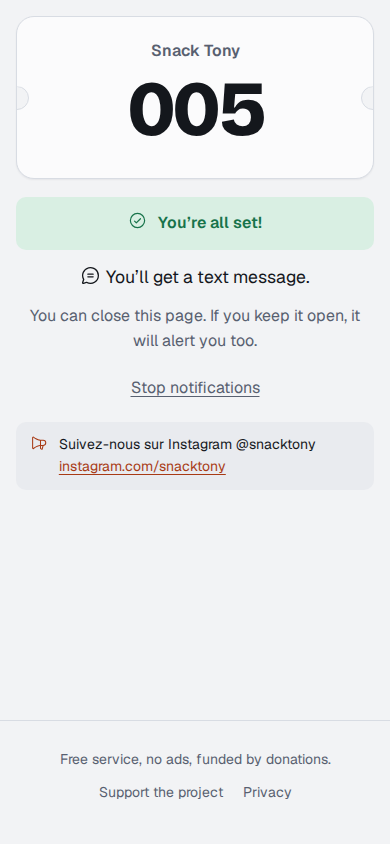
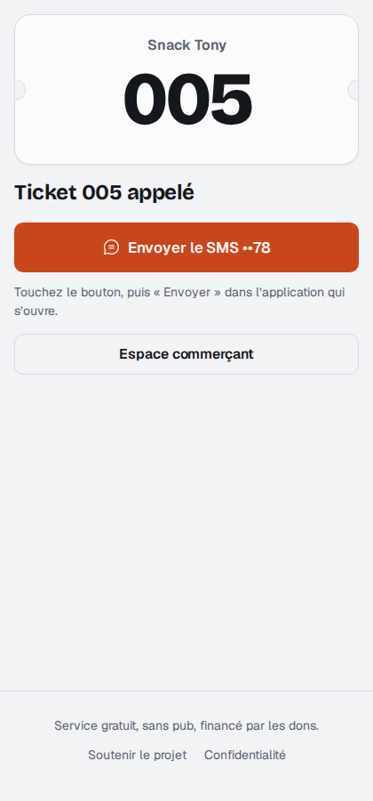
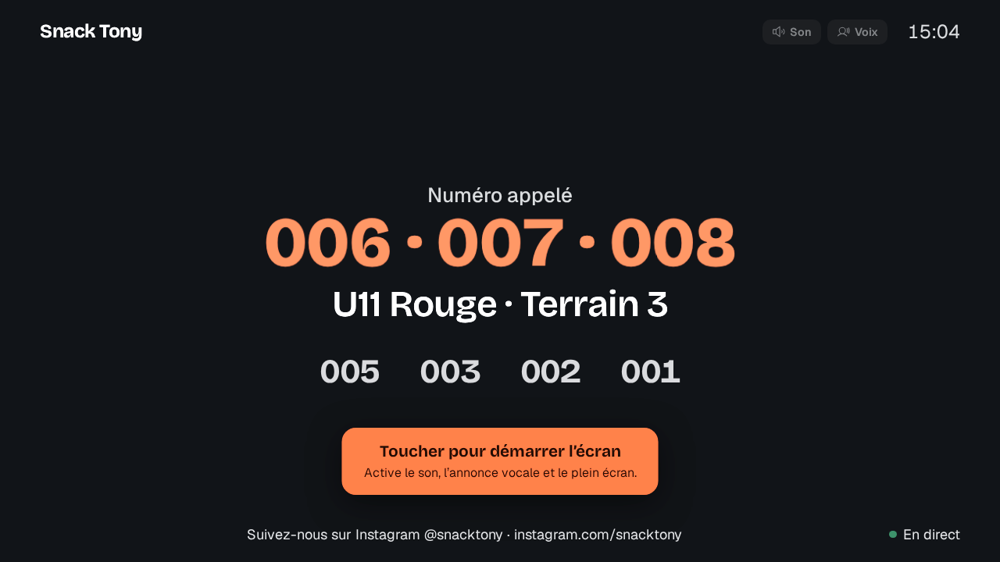
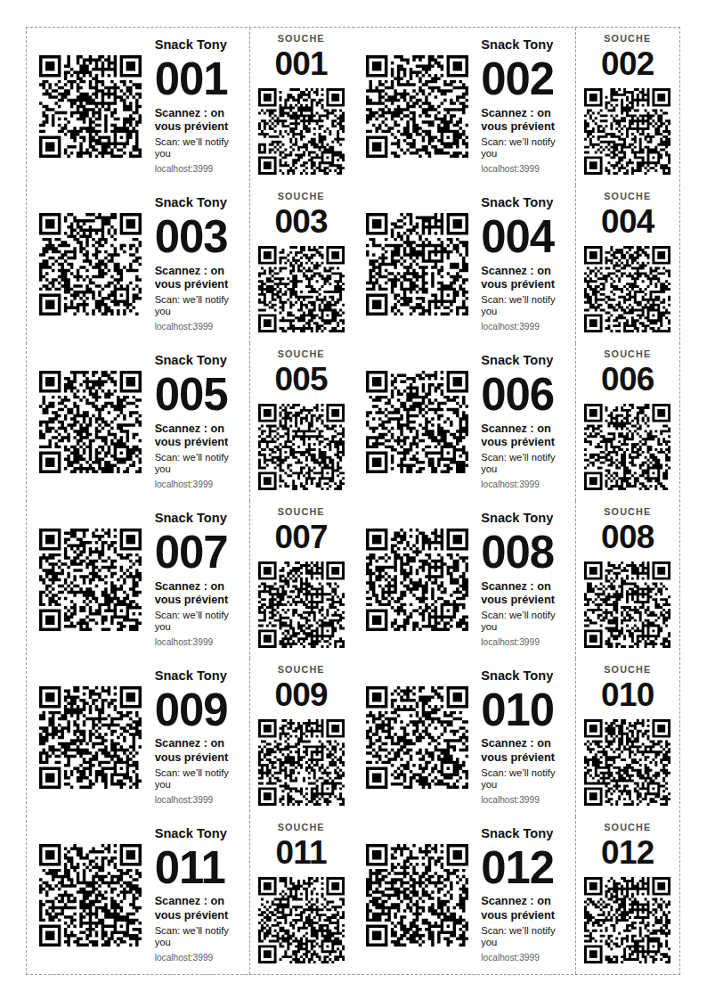

# WeCallYou

**Le ticket papier qui prévient vos clients.** Gratuit, sans compte, sans pub, open source, et le serveur ne peut pas lire les coordonnées de vos clients.

Votre client garde son petit ticket numéroté. S’il le scanne, il choisit comment être prévenu quand c’est son tour : notification, SMS, WhatsApp ou e-mail. S’il ne fait rien, vous l’appelez à voix haute, comme avant. La souche se colle sur la commande : quand c’est prêt, vous la scannez et le client est prévenu.

Snacks, food trucks, boulangeries, buvettes, tournois sportifs, vestiaires, cordonniers, SAV…

| Client | Souche scannée | Écran d’affichage | Tickets imprimés |
|---|---|---|---|
|  |  |  |  |

## Ce que ça fait

- **Création sans compte** : nom affiché, nombre de tickets (jusqu’à 999 999), premier numéro, 4 à 24 tickets par feuille A4, logo, numéro affiché ou non. Un PDF : page 1 = votre clé de lot et le mode d’emploi, puis les tickets avec leurs souches. Les gros lots s’impriment par cahiers de 50 pages.
- **Mot de passe de lot (facultatif)** : il entre dans le chiffrement ; sans lui, la page 1 ne vaut rien.
- **Le client choisit** parmi les moyens autorisés par le commerçant : notification (Android direct, iPhone après ajout à l’écran d’accueil), SMS, WhatsApp, e-mail, ou rien.
- **File d’attente en direct** : « Vous êtes le 3e · attente estimée ≈ 6 min », calculé sur le rythme réel des appels. La page du client passe au vert en temps réel quand c’est son tour.
- **Espace commerçant** : appel par scan de la souche ou par numéro, inscrits en attente, suivi de chaque ticket (scanné, inscrit, appelé, notification remise, vu par le client), statistiques anonymes, réimpression, réglages.
- **Écran public** pour tablette ou TV : un lien secret (avec QR pour l’ouvrir d’un scan), révocable. Grand numéro appelé en direct, carillon et **annonce vocale** (« Numéro 42. Terrain 3. »), derniers appels, rythme. Seulement des numéros, jamais d’inscrits.
- **Messages sur mesure** : modèle avec variables (`{nom}`, `{numero}`, `{groupe}` et vos propres listes déroulantes, avec sous-listes `U11 > Rouge`). Au moment de l’appel, on choisit dans les listes et on peut retoucher le texte avant l’envoi.
- **Groupes de tickets** (équipes, catégories : « U11 Rouge : 12-18, 25 ») : un appel prévient tout le groupe, avec un e-mail groupé en copie cachée. Inscrits filtrables par groupe.
- **Votre message** (facultatif) : partenaire, sponsor, réseaux sociaux, affiché sur la page du ticket et ajouté aux messages. C’est la seule « pub » possible : celle du créateur du lot.
- **Français et anglais**, selon la langue du téléphone ; chaque client reçoit son message dans sa langue.
- **Dons** ponctuels ou mensuels via Stripe, présentés au moment de la création des tickets, sans jamais bloquer.

## Sécurité et vie privée

Le principe : **le serveur ne sait rien d’utile**.

| Donnée | Où elle vit | Qui peut la lire |
|---|---|---|
| Clé du lot (page 1) | Papier + téléphones du commerçant | Le commerçant uniquement, jamais envoyée au serveur |
| Mot de passe du lot | Tête du commerçant | Personne d’autre ; seul son dérivé (PBKDF2) reste sur le téléphone |
| Numéro, e-mail, abonnement aux notifications | Chiffrés **sur le téléphone du client** avec la clé publique du lot | Le commerçant, au moment de l’appel |
| Ticket imprimé | Nulle part : le code du QR se vérifie par le calcul | — |
| Journal d’un ticket (scanné, appelé…) | Serveur, sans donnée personnelle | Le commerçant ; effacé en fin de vie du ticket |
| Statistiques | Serveur, compteurs par jour | Le commerçant ; 90 jours |

**Cryptographie** (WebCrypto, dans les navigateurs) :

- Code des QR : numéro de lot + numéro de ticket + rôle, chiffrés en un bloc AES-128 avec 56 bits de contrôle. Un code inventé a une chance sur 7·10¹⁶ d’être valide. Ticket client et souche ont des codes différents.
- Lot : clé de 128 bits (base32 sur la page 1) éventuellement renforcée par le mot de passe (PBKDF2-SHA256, 600 000 tours). HKDF en dérive le jeton d’accès (le serveur n’en garde que l’empreinte SHA-256) et la clé AES-GCM qui protège les clés privées du lot.
- Coordonnées : ECDH P-256 éphémère vers la clé publique du lot, HKDF, AES-256-GCM.
- Notifications : construites sur le téléphone du commerçant (RFC 8291 aes128gcm + VAPID RFC 8292 signé avec la clé du lot), puis **relayées à l’aveugle** par le serveur vers Google, Apple, Mozilla ou Microsoft uniquement.

**Durées de conservation** : coordonnées chiffrées effacées 30 min après l’appel ; tout ce qui concerne un ticket effacé à la fin de sa durée de vie (1 à 48 h après le premier scan, 6 h par défaut) ; statistiques 90 jours ; lots inutilisés 400 jours. Les sauvegardes de l’hébergeur ne contiennent donc que des blocs chiffrés.

**Défenses** : CSP stricte sans script tiers, aucun cookie, aucun traceur, `Referrer-Policy: no-referrer`, limites de débit, validation de toutes les entrées, liens SMS, WhatsApp et e-mail reconstruits seulement à partir de coordonnées validées (pas d’injection de destinataires), relais limité aux services de notification et sans redirection, fichiers en 0600.

**Limites connues** (assumées) :

- Page 1 et mot de passe perdus = inscriptions du lot illisibles, sans récupération possible. Il suffit de recréer un lot.
- Qui détient la page 1 (et le mot de passe) peut appeler les tickets et lire les inscrits : c’est une clé, à garder comme telle.
- Un téléphone de commerçant compromis donne accès aux lots qui y sont connectés.
- Sur iPhone, les notifications web exigent l’ajout du site à l’écran d’accueil ; SMS, WhatsApp et e-mail demandent un appui du commerçant (Apple et les opérateurs n’autorisent pas l’envoi silencieux).

Voir [SECURITY.md](SECURITY.md) pour signaler une faille.

## Architecture

```
public/            pages statiques servies par Apache (ou par Node en local)
  index.html       accueil + création d’un lot
  t.html           page d’un ticket (client ou souche) : /<code de 26 caractères>
  m.html           espace commerçant
  assets/          JS en modules ES, sans dépendance (sauf qrcode.js, MIT, hébergé ici)
  etat/            fichiers « prêt », secours du temps réel
  soutien.json     dons : liens Stripe, objectif, frais (à éditer à la main)
server/            API Node.js 24, AUCUNE dépendance npm
  app.cjs          fichier de démarrage (cPanel / Passenger)
  start.js         démarrage direct (node start.js)
  setup.js         création de config.json (clés secrètes)
  purge.js         purge manuelle (le serveur purge seul toutes les 10 min)
  lib/             api, stockage en fichiers, jetons, relais, temps réel (SSE), purge
  test/            tests (node --test)
e2e/               parcours complet dans Chromium (Playwright)
```

Stockage : de simples fichiers (`server/data/`), pas de base de données. Un ticket imprimé n’occupe rien ; il n’existe qu’à partir de son premier scan.

## Installer sur o2switch (ou tout cPanel avec Node.js)

1. **Nom de domaine** : pointez-le vers l’hébergement (Cloudflare devant est conseillé : SSL « Full (strict) », proxy activé).
2. **Fichiers** : en SSH, `git clone https://github.com/Fantinati-Anthony/BI-Wecallyou.git ~/wecallyou` (ou envoyez le dossier par le gestionnaire de fichiers).
3. **Racine du site** : dans cPanel > Domaines, réglez la racine du domaine sur `~/wecallyou/public`. **Surtout pas** sur `wecallyou/server`, qui contient les clés (il est protégé par son propre `.htaccess`, mais le site ne marcherait pas). Vérification : `https://votre-domaine/config.json` doit répondre « introuvable ».
4. **Application Node.js** : cPanel > *Setup Node.js App* > Créer une application :
   - Version de Node.js : **24.x**
   - Mode : *Production*
   - Racine de l’application : `wecallyou/server`
   - URL de l’application : `votre-domaine` + chemin **`api`**
   - Fichier de démarrage : **`app.cjs`**

   Il n’y a **rien à installer** (aucune dépendance npm).
5. **Configuration** (une seule fois) : cPanel affiche une commande `source …/bin/activate` ; dans le terminal :

   ```sh
   source /home/VOTRE_COMPTE/nodevenv/wecallyou/server/24/bin/activate
   cd ~/wecallyou/server
   node setup.js --domain=wecall.you --contact=contact@wecall.you
   ```

   Puis redémarrez l’application dans cPanel.
6. **Vérification** : `https://votre-domaine/api/info` doit répondre `{"ok":true,…}`.
7. **Sauvegarde** : copiez `server/config.json` en lieu sûr. **Ne régénérez jamais `tokenKey`** : tous les tickets déjà imprimés deviendraient invalides.
8. **Purge garantie** : l’application purge seule toutes les 10 min, mais l’hébergeur l’endort quand personne ne l’utilise. Ajoutez une tâche cron (cPanel > Tâches cron, toutes les 15 min) :

   ```sh
   /home/VOTRE_COMPTE/nodevenv/wecallyou/server/24/bin/node /home/VOTRE_COMPTE/wecallyou/server/purge.js >/dev/null 2>&1
   ```
9. **Mises à jour** : `cd ~/wecallyou && git pull`, puis *Redémarrer* l’application dans cPanel. `config.json` et `data/` ne sont jamais touchés.

### Activer les dons (Stripe)

1. Dans Stripe, créez des **Payment Links** :
   - « Une fois » : 3 €, 5 €, 10 €, 20 € (prix fixes) et un lien « le client choisit le montant » ;
   - « Chaque mois » : 2 €, 5 €, 10 € (abonnements).
2. Pour chaque lien, *Après le paiement* > rediriger vers `https://votre-domaine/merci`.
3. Collez les adresses dans `public/soutien.json` (champs `url`), ajustez `costs`, `goal_month` et, chaque mois, `raised_month`.

Tant qu’un lien est vide, le bouton affiche « Les dons ouvrent très bientôt ».

## Développer

```sh
cd server
node setup.js --local --domain=localhost:3000   # crée config.json (serveStatic: true)
node start.js                                    # http://localhost:3000
npm test                                         # tests serveur + cryptographie
cd ../e2e && npm install && node run.mjs         # parcours complet dans Chromium
```

La cryptographie du navigateur (`public/assets/crypto.js`) est testée dans Node contre une implémentation indépendante (déchiffrement RFC 8291 et vérification VAPID avec `node:crypto`). Le test de bout en bout relit les QR imprimés avec un décodeur indépendant.

## Contribuer, soutenir

- Contributions bienvenues : voir [CONTRIBUTING.md](CONTRIBUTING.md).
- Le service vit de vos dons : [wecall.you/soutenir](https://wecall.you/soutenir).

## Licence

[AGPL-3.0-or-later](LICENSE). Vous pouvez utiliser, modifier et héberger WeCallYou ; si vous le proposez comme service en ligne, publiez vos modifications. Le générateur de QR codes (`public/assets/qrcode.js`, Kazuhiko Arase) est sous licence MIT.

---

### In English

WeCallYou turns numbered paper tickets into notifying tickets: customers scan, choose how to be told (push, SMS, WhatsApp, email), and get alerted when it’s their turn, with a live queue position. Free, account-free, ad-free, open source (AGPL-3.0), and **zero-knowledge**: contact details are encrypted on the customer’s phone for the batch’s public key, so the server only stores unreadable blobs. Node.js 24 with no dependencies, file storage, deployable on any cPanel host. See the sections above for the security model and setup.
